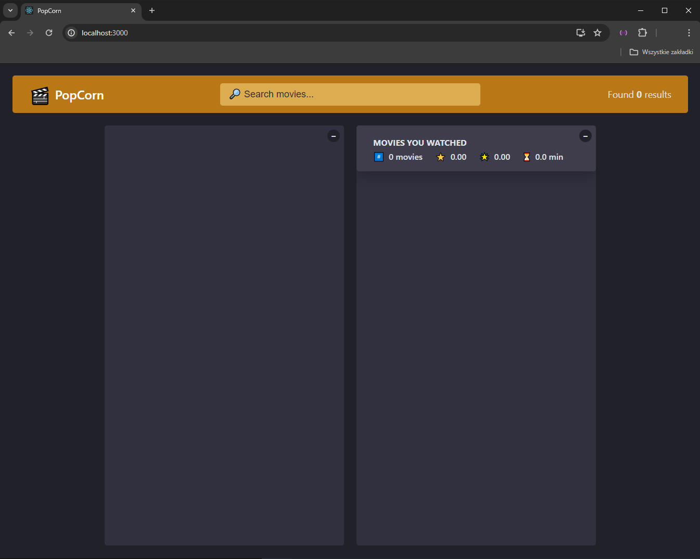
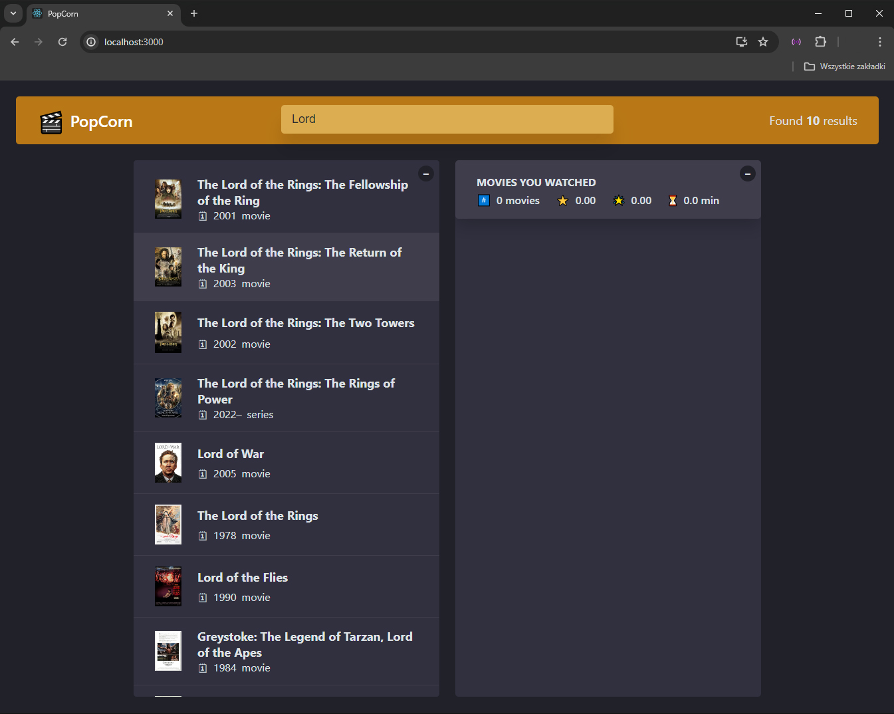
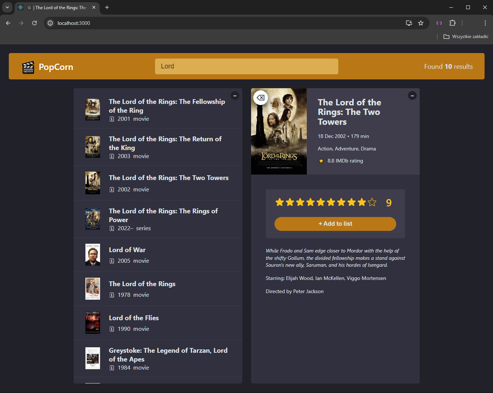
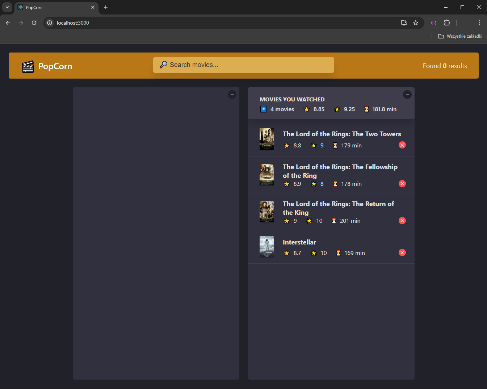

# PopCorn
Welcome to PopCorn Movies, a web application designed for movie enthusiasts to search for films, view IMDb ratings, manage their watchlist, and rate movies they have seen. This project demonstrates the use of React hooks, including useState and useEffect, for state management and handling side effects, as well as API fetching to retrieve movie data.

## Key components and solutions
- State Management
- Custom Hooks
- Components
- Data Fetching
- Event Handling
- Conditional Rendering
- Data Persistence

## Usage
1. Use the search bar to find movies.
2. Click on a movie to view its details.
3. Add movies to your watched list.
4. View summaries and manage your watched movies.

## Screenshots

